# Insurance Program

- **Diagram Type**: Logical
- **Package**: HomerSelect/BSL/Analysis Model/Insurance/Insurance Program - old BSL/Insurance program Root/Logical Data Model
- **Diagram ID**: 125713
- **Elements**: 19
- **Connectors**: 16

```mermaid
classDiagram
    class Ineligible_Profession["Ineligible Profession"]
    class Eligible_Commodity_Type["Eligible Commodity Type"]
    class Custom_Data_Definition["Custom Data Definition"]
    class Rounding["Rounding"]
    class Insurance_Custom_Data_Def["Insurance Custom Data Def"]
    class Logical_Data_Model_Custom_Data_definition["Logical Data Model : Custom Data definition"]
    class Insurance_Service_Insurance_Service["Insurance Service : Insurance Service"]
    class Salesroom["Salesroom"]
    class MOD_Partner["{MOD}Partner"]
    class Register_Inclusion_Frequency["Register Inclusion Frequency"]
    class Register_Inclusion_Date_Calculation["Register Inclusion Date Calculation"]
    class Revenue_Share_Frequency["Revenue Share Frequency"]
    class Revenue_Share_Base["Revenue Share Base"]
    class Insurance_Contract_Type["Insurance Contract Type"]
    class Insurance_Contract_Numbering["Insurance Contract Numbering"]
    class Max_Age_Restriction_Type["Max Age Restriction Type"]
    class Insurance_Eligibility_Criteria["Insurance Eligibility Criteria"]
    class Insurance_Subject_Type["Insurance Subject Type"]
    class Insurance_Program["Insurance Program"]
    Insurance_Program ..> Insurance_Contract_Type : unnamed
    Insurance_Program ..> Rounding : unnamed
    Insurance_Program ..> Salesroom : {DEL CLM-2618}
    Insurance_Program ..> Register_Inclusion_Frequency : unnamed
    Insurance_Program ..> Register_Inclusion_Date_Calculation : unnamed
    Insurance_Custom_Data_Def ..> Custom_Data_Definition : unnamed
    Insurance_Program ..> Revenue_Share_Base : unnamed
    Insurance_Program o-- Insurance_Custom_Data_Def : unnamed
    Insurance_Program ..> Insurance_Contract_Numbering : unnamed
    Insurance_Eligibility_Criteria ..> Max_Age_Restriction_Type : unnamed
    Insurance_Eligibility_Criteria o-- Ineligible_Profession : unnamed
    Insurance_Eligibility_Criteria o-- Eligible_Commodity_Type : unnamed
    Insurance_Program ..> Insurance_Subject_Type : unnamed
    Insurance_Program o-- Insurance_Eligibility_Criteria : unnamed
    Insurance_Program ..> Revenue_Share_Frequency : unnamed
    MOD_Partner o-- Salesroom : unnamed
```

