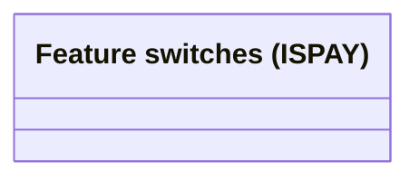

# Feature switches

- **Diagram Type**: Logical
- **Package**: HomerSelect/BSL/Analysis Model/Payments/Common for Payments/Feature switches
- **Diagram ID**: 161693
- **Elements**: 1
- **Connectors**: 0

