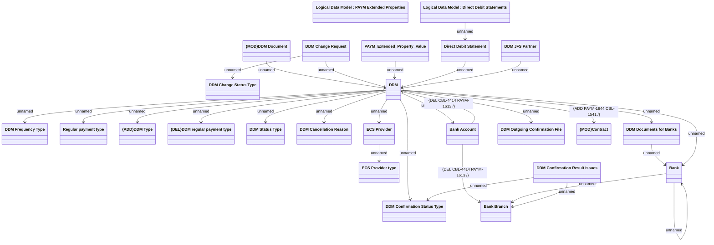

# Contract - DDM

```mermaid
classDiagram
    class Logical_Data_Model_PAYM_Extended_Properties["Logical Data Model : PAYM Extended Properties"]
    class PAYM_Extended_Property_Value["PAYM_Extended_Property_Value"]
    class DDM_Frequency_Type["DDM Frequency Type"]
    class DDM_JFS_Partner["DDM JFS Partner"]
    class Regular_payment_type["Regular payment type"]
    class ADD_DDM_Type["{ADD}DDM Type"]
    class DEL_DDM_regular_payment_type["{DEL}DDM regular payment type"]
    class DDM_Confirmation_Status_Type["DDM Confirmation Status Type"]
    class ECS_Provider_type["ECS Provider type"]
    class Logical_Data_Model_Direct_Debit_Statements["Logical Data Model : Direct Debit Statements"]
    class MOD_DDM_Document["{MOD}DDM Document"]
    class DDM_Status_Type["DDM Status Type"]
    class DDM_Cancellation_Reason["DDM Cancellation Reason"]
    class DDM_Change_Status_Type["DDM Change Status Type"]
    class DDM_Change_Request["DDM Change Request"]
    class Direct_Debit_Statement["Direct Debit Statement"]
    class Bank_Account["Bank Account"]
    class ECS_Provider["ECS Provider"]
    class Bank_Branch["Bank Branch"]
    class Bank["Bank"]
    class DDM_Documents_for_Banks["DDM Documents for Banks"]
    class DDM_Confirmation_Result_Issues["DDM Confirmation Result Issues"]
    class DDM_Outgoing_Confirmation_File["DDM Outgoing Confirmation File"]
    class DDM["DDM"]
    class MOD_Contract["{MOD}Contract"]
    Bank_Account --> Bank_Branch : {DEL CBL-4414 PAYM-1613 /}
    DDM --> Regular_payment_type : unnamed
    DDM --> ADD_DDM_Type : unnamed
    DDM --> DEL_DDM_regular_payment_type : unnamed
    DDM --> DDM_Confirmation_Status_Type : unnamed
    DDM_Confirmation_Result_Issues --> DDM_Confirmation_Status_Type : unnamed
    ECS_Provider --> ECS_Provider_type : unnamed
    DDM --> DDM_Status_Type : unnamed
    DDM --> DDM_Cancellation_Reason : unnamed
    DDM_Change_Request --> DDM_Change_Status_Type : unnamed
    Logical_Data_Model_Direct_Debit_Statements --> Direct_Debit_Statement : unnamed
    DDM --> Bank_Account : unnamed
    DDM --> DDM_Frequency_Type : unnamed
    Bank --> Bank_Branch : unnamed
    DDM --> MOD_Contract : {ADD PAYM-1844 CBL-1541 /}
    DDM_Confirmation_Result_Issues --> Bank_Branch : unnamed
    Bank --> Bank : unnamed
    DDM_Documents_for_Banks --> Bank : unnamed
    DDM --> Bank : unnamed
    DDM --> DDM_Documents_for_Banks : unnamed
    DDM --> DDM_Outgoing_Confirmation_File : unnamed
    MOD_DDM_Document --> DDM : unnamed
    Bank_Account --> DDM : {DEL CBL-4414 PAYM-1613 /}
    DDM_Change_Request --> DDM : unnamed
    PAYM_Extended_Property_Value --> DDM : unnamed
    Direct_Debit_Statement --> DDM : unnamed
    DDM_JFS_Partner --> DDM : unnamed
    DDM --> ECS_Provider : unnamed
```
