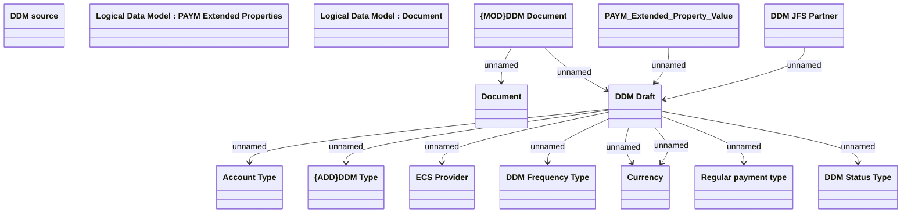

# DDM Draft

```mermaid
classDiagram
    class DDM_source["DDM source"]
    class Logical_Data_Model_PAYM_Extended_Properties["Logical Data Model : PAYM Extended Properties"]
    class Logical_Data_Model_Document["Logical Data Model : Document "]
    class PAYM_Extended_Property_Value["PAYM_Extended_Property_Value"]
    class Document["Document"]
    class MOD_DDM_Document["{MOD}DDM Document"]
    class DDM_JFS_Partner["DDM JFS Partner"]
    class DDM_Status_Type["DDM Status Type"]
    class Regular_payment_type["Regular payment type"]
    class Currency["Currency"]
    class DDM_Frequency_Type["DDM Frequency Type"]
    class ECS_Provider["ECS Provider"]
    class ADD_DDM_Type["{ADD}DDM Type"]
    class Account_Type["Account Type"]
    class DDM_Draft["DDM Draft"]
    DDM_JFS_Partner --> DDM_Draft : unnamed
    PAYM_Extended_Property_Value --> DDM_Draft : unnamed
    MOD_DDM_Document --> DDM_Draft : unnamed
    DDM_Draft --> Account_Type : unnamed
    DDM_Draft --> ADD_DDM_Type : unnamed
    DDM_Draft --> ECS_Provider : unnamed
    DDM_Draft --> DDM_Frequency_Type : unnamed
    DDM_Draft --> Currency : unnamed
    DDM_Draft --> Currency : unnamed
    DDM_Draft --> Regular_payment_type : unnamed
    DDM_Draft --> DDM_Status_Type : unnamed
    MOD_DDM_Document --> Document : unnamed
```
