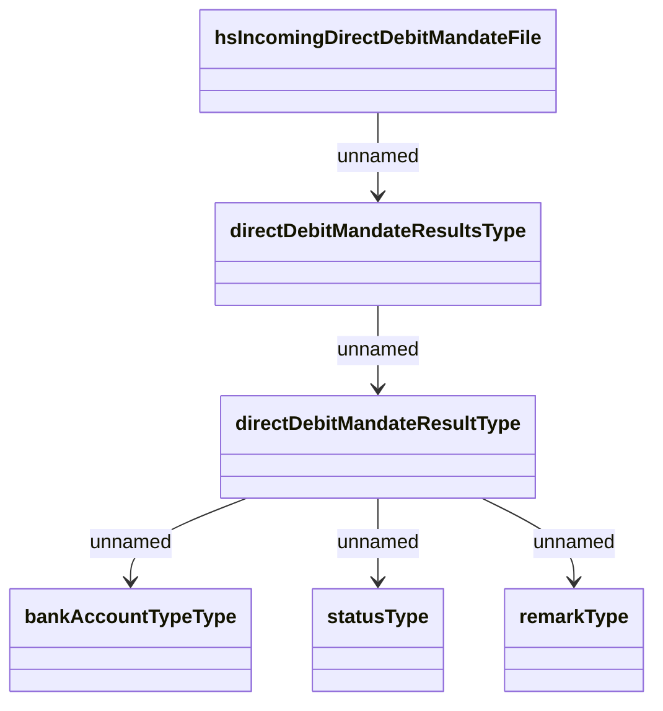

# IncomingDirectDebitMandates

- **Diagram Type**: Logical
- **Package**: HomerSelect/BSL/Analysis Model/Payments/Direct Debit Mandate (DDM)/DDM confirmation/Logical Data Model/IncomingDirectDebitMandates
- **Diagram ID**: 162646
- **Elements**: 6
- **Connectors**: 5

