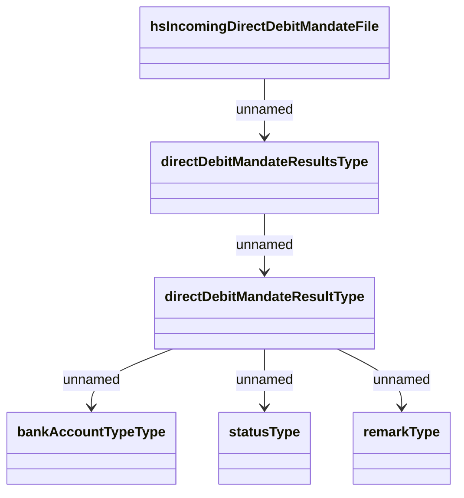

# IncomingDirectDebitMandates

```mermaid
classDiagram
    class remarkType["remarkType"]
    class statusType["statusType"]
    class bankAccountTypeType["bankAccountTypeType"]
    class directDebitMandateResultType["directDebitMandateResultType"]
    class directDebitMandateResultsType["directDebitMandateResultsType"]
    class hsIncomingDirectDebitMandateFile["hsIncomingDirectDebitMandateFile"]
    hsIncomingDirectDebitMandateFile --> directDebitMandateResultsType : unnamed
    directDebitMandateResultsType --> directDebitMandateResultType : unnamed
    directDebitMandateResultType --> bankAccountTypeType : unnamed
    directDebitMandateResultType --> statusType : unnamed
    directDebitMandateResultType --> remarkType : unnamed
```
