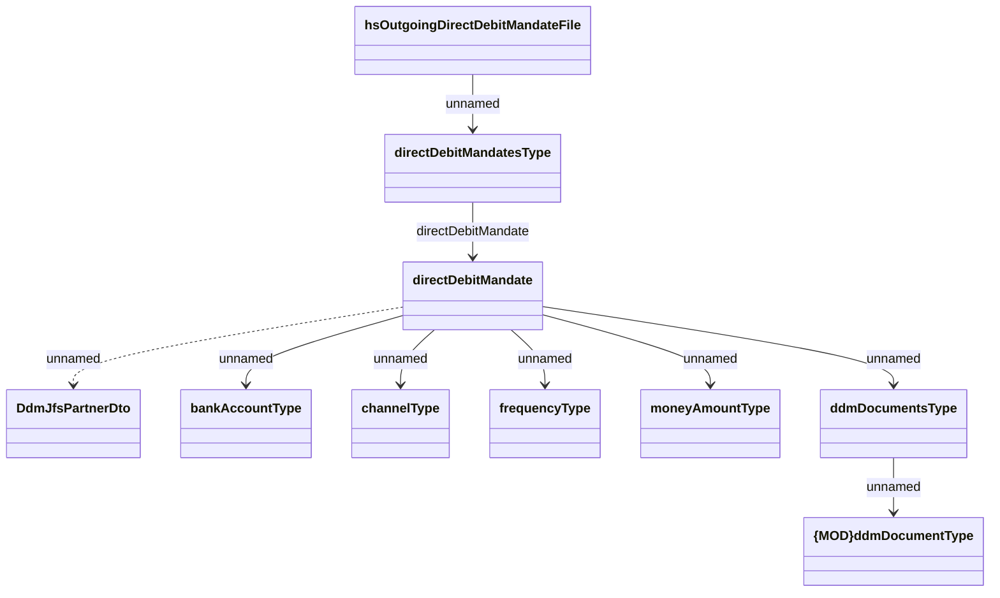

# OutgoingDirectDebitMandates

- **Diagram Type**: Logical
- **Package**: HomerSelect/BSL/Analysis Model/Payments/Direct Debit Mandate (DDM)/DDM confirmation/Logical Data Model/OutgoingDirectDebitMandates
- **Diagram ID**: 126805
- **Elements**: 10
- **Connectors**: 9

