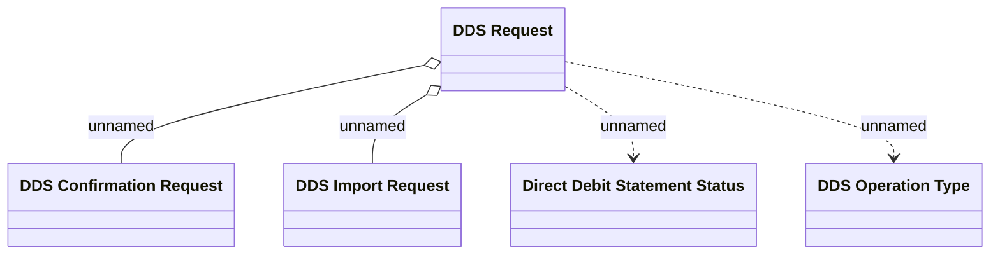

# DDS Request

- **Diagram Type**: Logical
- **Package**: HomerSelect/BSL/Analysis Model/Payments/Direct Debit Statements/Logical Data Model
- **Diagram ID**: 151682
- **Elements**: 5
- **Connectors**: 4

