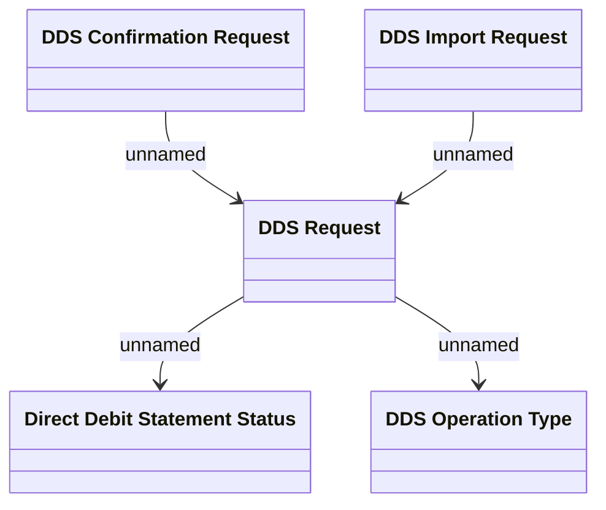

# DDS Request

```mermaid
classDiagram
    class DDS_Import_Request["DDS Import Request"]
    class DDS_Operation_Type["DDS Operation Type"]
    class Direct_Debit_Statement_Status["Direct Debit Statement Status"]
    class DDS_Confirmation_Request["DDS Confirmation Request"]
    class DDS_Request["DDS Request"]
    DDS_Confirmation_Request --> DDS_Request : unnamed
    DDS_Import_Request --> DDS_Request : unnamed
    DDS_Request --> Direct_Debit_Statement_Status : unnamed
    DDS_Request --> DDS_Operation_Type : unnamed
```
