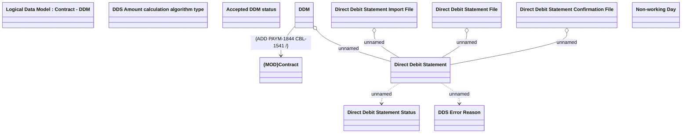

# Direct Debit Statements

- **Diagram Type**: Logical
- **Package**: HomerSelect/BSL/Analysis Model/Payments/Direct Debit Statements/Logical Data Model
- **Diagram ID**: 151681
- **Elements**: 12
- **Connectors**: 7

