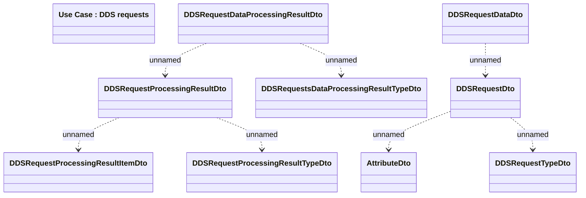

# DDS Requests - file structure

- **Diagram Type**: Logical
- **Package**: HomerSelect/BSL/Analysis Model/Payments/Direct Debit Statements/Logical Data Model/DDSRequest - file structure
- **Diagram ID**: 98543
- **Elements**: 10
- **Connectors**: 7

