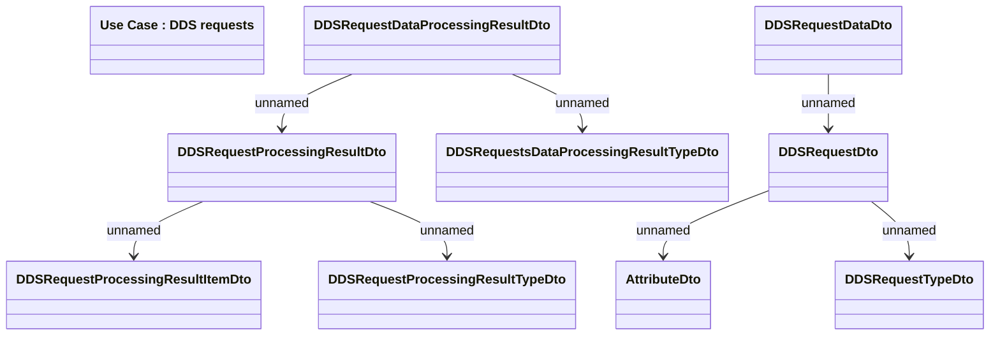

# DDS Requests - file structure

```mermaid
classDiagram
    class AttributeDto["AttributeDto"]
    class DDSRequestProcessingResultItemDto["DDSRequestProcessingResultItemDto"]
    class Use_Case_DDS_requests["Use Case : DDS requests"]
    class DDSRequestProcessingResultTypeDto["DDSRequestProcessingResultTypeDto"]
    class DDSRequestProcessingResultDto["DDSRequestProcessingResultDto"]
    class DDSRequestTypeDto["DDSRequestTypeDto"]
    class DDSRequestsDataProcessingResultTypeDto["DDSRequestsDataProcessingResultTypeDto"]
    class DDSRequestDto["DDSRequestDto"]
    class DDSRequestDataProcessingResultDto["DDSRequestDataProcessingResultDto"]
    class DDSRequestDataDto["DDSRequestDataDto"]
    DDSRequestDataDto --> DDSRequestDto : unnamed
    DDSRequestDataProcessingResultDto --> DDSRequestsDataProcessingResultTypeDto : unnamed
    DDSRequestDataProcessingResultDto --> DDSRequestProcessingResultDto : unnamed
    DDSRequestDto --> AttributeDto : unnamed
    DDSRequestDto --> DDSRequestTypeDto : unnamed
    DDSRequestProcessingResultDto --> DDSRequestProcessingResultItemDto : unnamed
    DDSRequestProcessingResultDto --> DDSRequestProcessingResultTypeDto : unnamed
```
