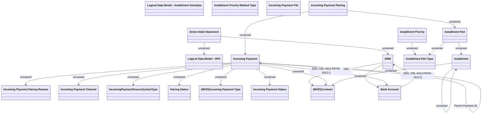

# Incoming payments

```mermaid
classDiagram
    class Incoming_Payment_Pairing_Reason["Incoming Payment Pairing Reason "]
    class Incoming_Payment_Channel["Incoming Payment Channel"]
    class Logical_Data_Model_Installment_Schedule["Logical Data Model : Installment Schedule"]
    class IncomingPaymentSourceSystemType["IncomingPaymentSourceSystemType"]
    class Installment_Priority_Method_Type["Installment Priority Method Type"]
    class Incoming_Payment_File["Incoming Payment File"]
    class Logical_Data_Model_DPC["Logical Data Model : DPC"]
    class Pairing_Status["Pairing Status"]
    class MOD_Incoming_Payment_Type["{MOD}Incoming Payment Type"]
    class Incoming_Payment_Status["Incoming Payment Status"]
    class DDM["DDM"]
    class Installment["Installment"]
    class Incoming_Payment_Pairing["Incoming Payment Pairing"]
    class MOD_Contract["{MOD}Contract"]
    class Bank_Account["Bank Account"]
    class Installment_Part_Type["Installment Part Type"]
    class Installment_Part["Installment Part"]
    class Direct_Debit_Statement["Direct Debit Statement"]
    class Incoming_Payment["Incoming Payment"]
    class Installment_Priority["Installment Priority"]
    DDM --> MOD_Contract : {ADD PAYM-1844 CBL-1541 /}
    Incoming_Payment --> Incoming_Payment_Channel : unnamed
    Incoming_Payment --> IncomingPaymentSourceSystemType : unnamed
    Direct_Debit_Statement --> Logical_Data_Model_DPC : unnamed
    Incoming_Payment --> Pairing_Status : unnamed
    Incoming_Payment --> MOD_Incoming_Payment_Type : unnamed
    Incoming_Payment --> Incoming_Payment_Status : unnamed
    Direct_Debit_Statement --> DDM : unnamed
    Bank_Account --> DDM : {DEL CBL-4414 PAYM-1613 /}
    Incoming_Payment --> Incoming_Payment_Pairing_Reason : unnamed
    Installment_Part --> Installment : unnamed
    Incoming_Payment --> Incoming_Payment : Original payment ID
    Incoming_Payment --> MOD_Contract : unnamed
    DDM --> Bank_Account : unnamed
    Incoming_Payment --> Bank_Account : {DEL CBL-4414 PAYM-1613 /}
    Installment_Priority --> Installment_Part_Type : unnamed
    Installment_Part --> Installment_Part_Type : unnamed
    Incoming_Payment_Pairing --> Installment_Part : unnamed
    Incoming_Payment --> Incoming_Payment : Parent Payment ID
    Incoming_Payment_Pairing --> Incoming_Payment : unnamed
    Installment --> Installment : unnamed
    Installment --> MOD_Contract : unnamed
```
