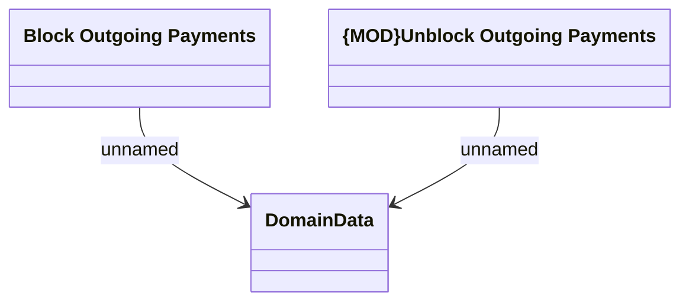

# RabbitMQ Messages - Domain Data

- **Diagram Type**: Logical
- **Package**: HomerSelect/BSL/Analysis Model/Payments/Outgoing payments/Blocking outgoing payments/RabbitMQ Messages
- **Diagram ID**: 149022
- **Elements**: 3
- **Connectors**: 2

