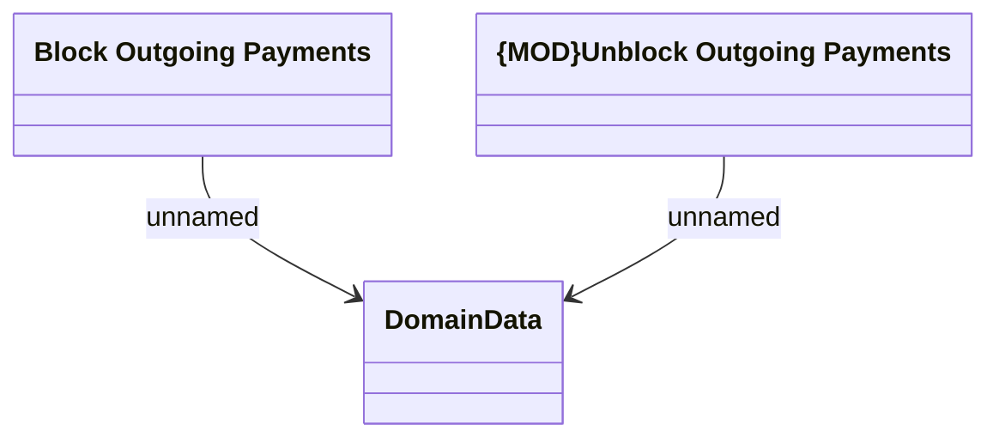

# RabbitMQ Messages - Domain Data

```mermaid
classDiagram
    class MOD_Unblock_Outgoing_Payments["{MOD}Unblock Outgoing Payments"]
    class Block_Outgoing_Payments["Block Outgoing Payments"]
    class DomainData["DomainData "]
    Block_Outgoing_Payments --> DomainData : unnamed
    MOD_Unblock_Outgoing_Payments --> DomainData : unnamed
```
