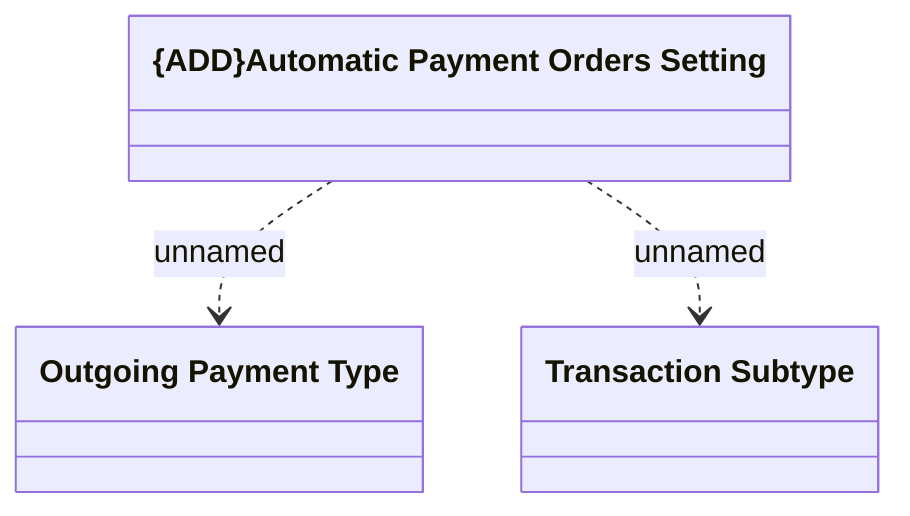

# Automatic Outgoing Payment Orders Setting

- **Diagram Type**: Logical
- **Package**: HomerSelect/BSL/Analysis Model/Payments/Outgoing payments/COMMON for Outgoing Payments/Logical Data Model
- **Diagram ID**: 151002
- **Elements**: 3
- **Connectors**: 2

