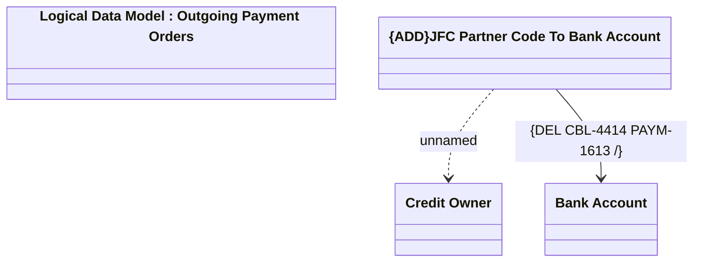

# Automatic source bank account assignment - OP orders

- **Diagram Type**: Logical
- **Package**: HomerSelect/BSL/Analysis Model/Payments/Outgoing payments/COMMON for Outgoing Payments/Logical Data Model
- **Diagram ID**: 151003
- **Elements**: 4
- **Connectors**: 2

