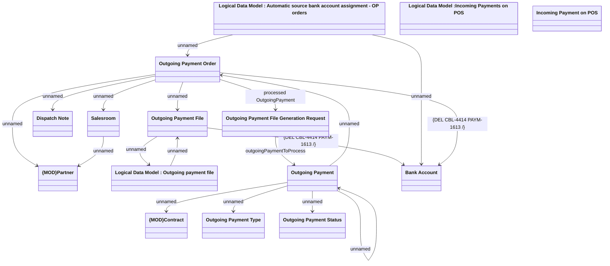

# Outgoing Payment Orders

```mermaid
classDiagram
    class Logical_Data_Model_Automatic_source_bank_account_assignment_["Logical Data Model : Automatic source bank account assignment - OP orders"]
    class Logical_Data_Model_Incoming_Payments_on_POS["Logical Data Model :Incoming Payments on POS"]
    class Outgoing_Payment_File_Generation_Request["Outgoing Payment File Generation Request"]
    class MOD_Partner["{MOD}Partner"]
    class Dispatch_Note["Dispatch Note"]
    class Logical_Data_Model_Outgoing_payment_file["Logical Data Model : Outgoing payment file"]
    class Outgoing_Payment_File["Outgoing Payment File"]
    class Salesroom["Salesroom"]
    class MOD_Contract["{MOD}Contract"]
    class Outgoing_Payment_Type["Outgoing Payment Type"]
    class Outgoing_Payment["Outgoing Payment"]
    class Outgoing_Payment_Status["Outgoing Payment Status"]
    class Outgoing_Payment_Order["Outgoing Payment Order"]
    class Bank_Account["Bank Account"]
    class Incoming_Payment_on_POS["Incoming Payment on POS"]
    Outgoing_Payment --> MOD_Contract : unnamed
    Logical_Data_Model_Automatic_source_bank_account_assignment_ --> Outgoing_Payment_Order : unnamed
    Outgoing_Payment_File_Generation_Request --> Outgoing_Payment : outgoingPaymentToProcess
    Logical_Data_Model_Outgoing_payment_file --> Outgoing_Payment_File : unnamed
    Outgoing_Payment_File --> Logical_Data_Model_Outgoing_payment_file : unnamed
    Outgoing_Payment_File --> Bank_Account : {DEL CBL-4414 PAYM-1613 /}
    Logical_Data_Model_Automatic_source_bank_account_assignment_ --> Bank_Account : unnamed
    Outgoing_Payment --> Outgoing_Payment : unnamed
    Outgoing_Payment_Order --> Outgoing_Payment_File_Generation_Request : processed OutgoingPayment
    Outgoing_Payment --> Outgoing_Payment_Order : unnamed
    Outgoing_Payment --> Outgoing_Payment_Type : unnamed
    Outgoing_Payment --> Outgoing_Payment_Status : unnamed
    Outgoing_Payment_Order --> Outgoing_Payment_File : unnamed
    Outgoing_Payment_Order --> Salesroom : unnamed
    Outgoing_Payment_Order --> Dispatch_Note : unnamed
    Outgoing_Payment_Order --> Bank_Account : {DEL CBL-4414 PAYM-1613 /}
    Outgoing_Payment_Order --> MOD_Partner : unnamed
    Salesroom --> MOD_Partner : unnamed
```
