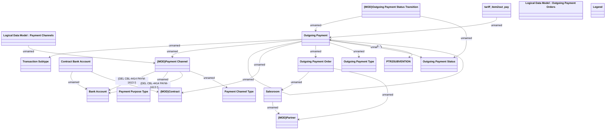

# Outgoing Payments

```mermaid
classDiagram
    class tariff_item2out_pay["tariff_item2out_pay"]
    class MOD_Outgoing_Payment_Status_Transition["{MOD}Outgoing Payment Status Transition"]
    class Transaction_Subtype["Transaction Subtype"]
    class Contract_Bank_Account["Contract Bank Account"]
    class Logical_Data_Model_Outgoing_Payment_Orders["Logical Data Model : Outgoing Payment Orders"]
    class Outgoing_Payment_Order["Outgoing Payment Order"]
    class Bank_Account["Bank Account"]
    class Legend["Legend"]
    class Logical_Data_Model_Payment_Channels["Logical Data Model : Payment Channels"]
    class MOD_Partner["{MOD}Partner"]
    class Outgoing_Payment_Status["Outgoing Payment Status"]
    class Outgoing_Payment_Type["Outgoing Payment Type"]
    class Salesroom["Salesroom"]
    class Payment_Channel_Type["Payment Channel Type"]
    class Outgoing_Payment["Outgoing Payment"]
    class Payment_Purpose_Type["Payment Purpose Type"]
    class MOD_Payment_Channel["{MOD}Payment Channel"]
    class MOD_Contract["{MOD}Contract"]
    class PTR2SUBVENTION["PTR2SUBVENTION"]
    Outgoing_Payment --> Transaction_Subtype : unnamed
    MOD_Outgoing_Payment_Status_Transition --> Outgoing_Payment : unnamed
    MOD_Outgoing_Payment_Status_Transition --> Outgoing_Payment_Status : unnamed
    Outgoing_Payment_Order --> Salesroom : unnamed
    Outgoing_Payment_Order --> MOD_Partner : unnamed
    Logical_Data_Model_Payment_Channels --> MOD_Payment_Channel : unnamed
    tariff_item2out_pay --> Outgoing_Payment : unnamed
    Outgoing_Payment --> MOD_Payment_Channel : unnamed
    Outgoing_Payment --> Outgoing_Payment : unnamed
    Outgoing_Payment --> MOD_Contract : unnamed
    Outgoing_Payment --> Outgoing_Payment_Order : unnamed
    Outgoing_Payment --> Outgoing_Payment_Type : unnamed
    Outgoing_Payment --> Outgoing_Payment_Status : unnamed
    Outgoing_Payment --> PTR2SUBVENTION : 0..*
    Salesroom --> MOD_Partner : unnamed
    Contract_Bank_Account --> Bank_Account : unnamed
    Contract_Bank_Account --> MOD_Contract : unnamed
    MOD_Payment_Channel --> Bank_Account : {DEL CBL-4414 PAYM-1613 /}
    MOD_Payment_Channel --> Payment_Purpose_Type : unnamed
    MOD_Payment_Channel --> Bank_Account : {DEL CBL-4414 PAYM-1613 /}
    MOD_Payment_Channel --> Payment_Channel_Type : unnamed
```
