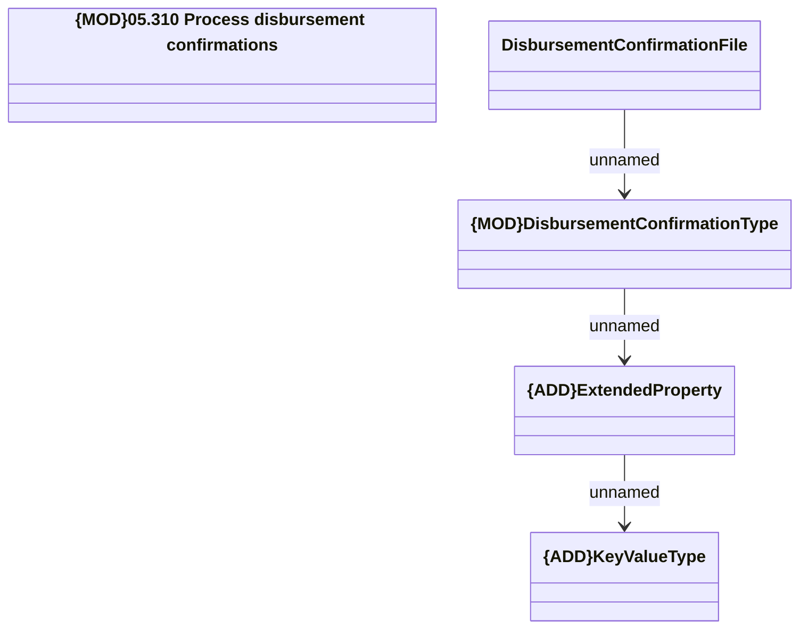

# DisbursementConfirmationFile

```mermaid
classDiagram
    class MOD_05_310_Process_disbursement_confirmations["{MOD}05.310 Process disbursement confirmations"]
    class ADD_KeyValueType["{ADD}KeyValueType"]
    class ADD_ExtendedProperty["{ADD}ExtendedProperty"]
    class MOD_DisbursementConfirmationType["{MOD}DisbursementConfirmationType"]
    class DisbursementConfirmationFile["DisbursementConfirmationFile"]
    DisbursementConfirmationFile --> MOD_DisbursementConfirmationType : unnamed
    MOD_DisbursementConfirmationType --> ADD_ExtendedProperty : unnamed
    ADD_ExtendedProperty --> ADD_KeyValueType : unnamed
```
