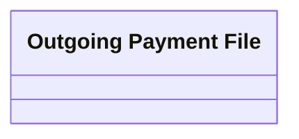

# Outgoing payment file

- **Diagram Type**: Logical
- **Package**: HomerSelect/BSL/Analysis Model/Payments/Outgoing payments/Outgoing  payment files management/Logical Data Model
- **Diagram ID**: 123796
- **Elements**: 1
- **Connectors**: 0

