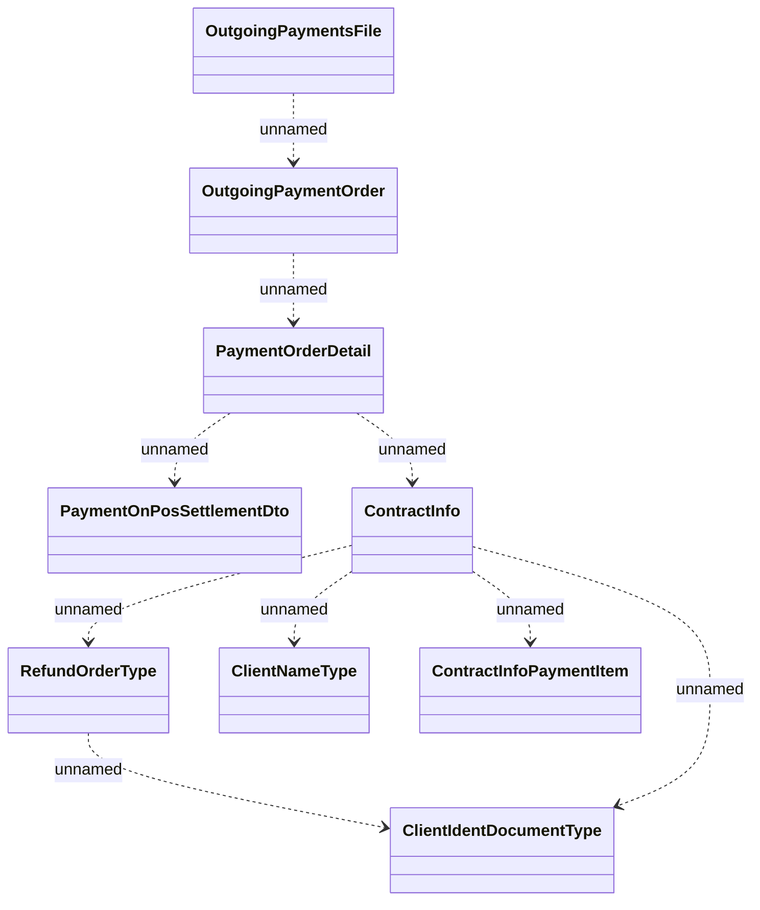

# Outgoing Payment File Structure

- **Diagram Type**: Logical
- **Package**: HomerSelect/BSL/Analysis Model/Payments/Outgoing payments/Outgoing  payment files management/Logical Data Model/Outgoing Payment File Structure
- **Diagram ID**: 123893
- **Elements**: 9
- **Connectors**: 9

