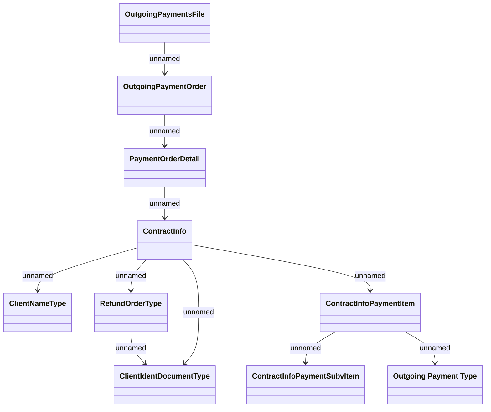

# Outgoing Payment JMS structure V2 

```mermaid
classDiagram
    class ContractInfoPaymentSubvItem["ContractInfoPaymentSubvItem"]
    class Outgoing_Payment_Type["Outgoing Payment Type"]
    class ClientNameType["ClientNameType"]
    class ClientIdentDocumentType["ClientIdentDocumentType"]
    class ContractInfoPaymentItem["ContractInfoPaymentItem"]
    class RefundOrderType["RefundOrderType"]
    class OutgoingPaymentsFile["OutgoingPaymentsFile"]
    class OutgoingPaymentOrder["OutgoingPaymentOrder"]
    class PaymentOrderDetail["PaymentOrderDetail"]
    class ContractInfo["ContractInfo"]
    ContractInfoPaymentItem --> ContractInfoPaymentSubvItem : unnamed
    PaymentOrderDetail --> ContractInfo : unnamed
    OutgoingPaymentOrder --> PaymentOrderDetail : unnamed
    OutgoingPaymentsFile --> OutgoingPaymentOrder : unnamed
    ContractInfo --> RefundOrderType : unnamed
    ContractInfo --> ContractInfoPaymentItem : unnamed
    RefundOrderType --> ClientIdentDocumentType : unnamed
    ContractInfo --> ClientIdentDocumentType : unnamed
    ContractInfo --> ClientNameType : unnamed
    ContractInfoPaymentItem --> Outgoing_Payment_Type : unnamed
```
