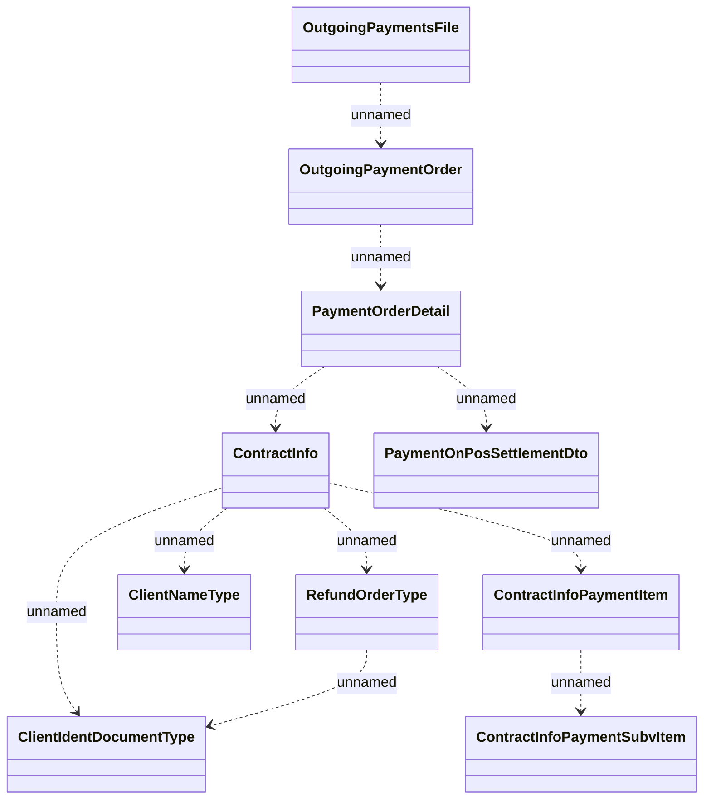

# Outgoing Payment JMS structure

- **Diagram Type**: Logical
- **Package**: HomerSelect/BSL/Analysis Model/Payments/Outgoing payments/Outgoing payment JMS structure/Logical Data Model/Outgoing Payment JMS structure
- **Diagram ID**: 134520
- **Elements**: 10
- **Connectors**: 10

