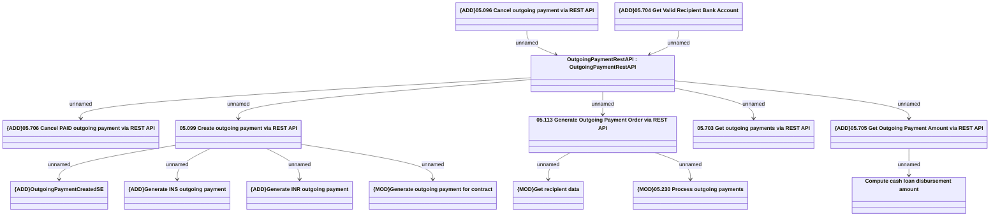

# OutgoingPaymentRestAPI

```mermaid
classDiagram
    class ADD_05_706_Cancel_PAID_outgoing_payment_via_REST_API["{ADD}05.706 Cancel PAID outgoing payment via REST API"]
    class Compute_cash_loan_disbursement_amount["Compute cash loan disbursement amount"]
    class ADD_05_705_Get_Outgoing_Payment_Amount_via_REST_API["{ADD}05.705 Get Outgoing Payment Amount via REST API"]
    class ADD_05_096_Cancel_outgoing_payment_via_REST_API["{ADD}05.096 Cancel outgoing payment via REST API"]
    class ADD_05_704_Get_Valid_Recipient_Bank_Account["{ADD}05.704 Get Valid Recipient Bank Account"]
    class MOD_Generate_outgoing_payment_for_contract["{MOD}Generate outgoing payment for contract"]
    class ADD_Generate_INR_outgoing_payment["{ADD}Generate INR outgoing payment"]
    class ADD_Generate_INS_outgoing_payment["{ADD}Generate INS outgoing payment "]
    class ADD_OutgoingPaymentCreatedSE["{ADD}OutgoingPaymentCreatedSE"]
    class MOD_05_230_Process_outgoing_payments["{MOD}05.230 Process outgoing payments"]
    class MOD_Get_recipient_data["{MOD}Get recipient data"]
    class n_05_113_Generate_Outgoing_Payment_Order_via_REST_API["05.113 Generate Outgoing Payment Order via REST API"]
    class n_05_703_Get_outgoing_payments_via_REST_API["05.703 Get outgoing payments via REST API"]
    class OutgoingPaymentRestAPI_OutgoingPaymentRestAPI["OutgoingPaymentRestAPI : OutgoingPaymentRestAPI"]
    class n_05_099_Create_outgoing_payment_via_REST_API["05.099 Create outgoing payment via REST API"]
    OutgoingPaymentRestAPI_OutgoingPaymentRestAPI --> ADD_05_706_Cancel_PAID_outgoing_payment_via_REST_API : unnamed
    OutgoingPaymentRestAPI_OutgoingPaymentRestAPI --> n_05_099_Create_outgoing_payment_via_REST_API : unnamed
    ADD_05_096_Cancel_outgoing_payment_via_REST_API --> OutgoingPaymentRestAPI_OutgoingPaymentRestAPI : unnamed
    ADD_05_704_Get_Valid_Recipient_Bank_Account --> OutgoingPaymentRestAPI_OutgoingPaymentRestAPI : unnamed
    OutgoingPaymentRestAPI_OutgoingPaymentRestAPI --> n_05_703_Get_outgoing_payments_via_REST_API : unnamed
    OutgoingPaymentRestAPI_OutgoingPaymentRestAPI --> n_05_113_Generate_Outgoing_Payment_Order_via_REST_API : unnamed
    n_05_113_Generate_Outgoing_Payment_Order_via_REST_API --> MOD_Get_recipient_data : unnamed
    n_05_113_Generate_Outgoing_Payment_Order_via_REST_API --> MOD_05_230_Process_outgoing_payments : unnamed
    n_05_099_Create_outgoing_payment_via_REST_API --> ADD_OutgoingPaymentCreatedSE : unnamed
    n_05_099_Create_outgoing_payment_via_REST_API --> ADD_Generate_INS_outgoing_payment : unnamed
    n_05_099_Create_outgoing_payment_via_REST_API --> ADD_Generate_INR_outgoing_payment : unnamed
    n_05_099_Create_outgoing_payment_via_REST_API --> MOD_Generate_outgoing_payment_for_contract : unnamed
    OutgoingPaymentRestAPI_OutgoingPaymentRestAPI --> ADD_05_705_Get_Outgoing_Payment_Amount_via_REST_API : unnamed
    ADD_05_705_Get_Outgoing_Payment_Amount_via_REST_API --> Compute_cash_loan_disbursement_amount : unnamed
```
