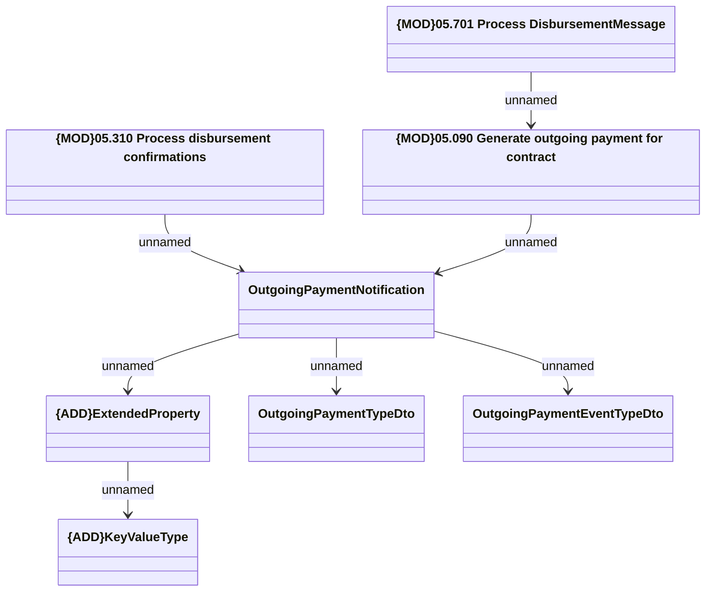

# RabbitMQ messages - OutgoingPaymentNotification

```mermaid
classDiagram
    class MOD_05_310_Process_disbursement_confirmations["{MOD}05.310 Process disbursement confirmations"]
    class MOD_05_090_Generate_outgoing_payment_for_contract["{MOD}05.090 Generate outgoing payment for contract"]
    class MOD_05_701_Process_DisbursementMessage["{MOD}05.701 Process DisbursementMessage"]
    class ADD_KeyValueType["{ADD}KeyValueType"]
    class ADD_ExtendedProperty["{ADD}ExtendedProperty"]
    class OutgoingPaymentTypeDto["OutgoingPaymentTypeDto"]
    class OutgoingPaymentEventTypeDto["OutgoingPaymentEventTypeDto"]
    class OutgoingPaymentNotification["OutgoingPaymentNotification"]
    OutgoingPaymentNotification --> OutgoingPaymentEventTypeDto : unnamed
    OutgoingPaymentNotification --> OutgoingPaymentTypeDto : unnamed
    OutgoingPaymentNotification --> ADD_ExtendedProperty : unnamed
    ADD_ExtendedProperty --> ADD_KeyValueType : unnamed
    MOD_05_701_Process_DisbursementMessage --> MOD_05_090_Generate_outgoing_payment_for_contract : unnamed
    MOD_05_310_Process_disbursement_confirmations --> OutgoingPaymentNotification : unnamed
    MOD_05_090_Generate_outgoing_payment_for_contract --> OutgoingPaymentNotification : unnamed
```
