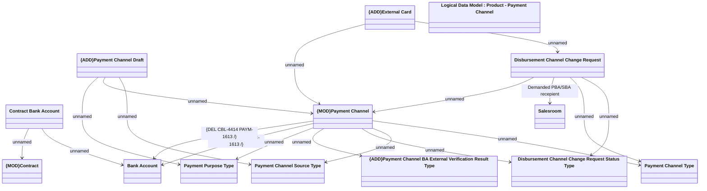

# Payment Channels

```mermaid
classDiagram
    class ADD_Payment_Channel_Draft["{ADD}Payment Channel Draft"]
    class ADD_Payment_Channel_BA_External_Verification_Result_Type["{ADD}Payment Channel BA External Verification Result Type"]
    class ADD_External_Card["{ADD}External Card"]
    class Payment_Channel_Source_Type["Payment Channel Source Type"]
    class Disbursement_Channel_Change_Request_Status_Type["Disbursement Channel Change Request Status Type"]
    class Disbursement_Channel_Change_Request["Disbursement Channel Change Request"]
    class Contract_Bank_Account["Contract Bank Account"]
    class Logical_Data_Model_Product_Payment_Channel["Logical Data Model : Product - Payment Channel"]
    class MOD_Contract["{MOD}Contract"]
    class Payment_Purpose_Type["Payment Purpose Type"]
    class Payment_Channel_Type["Payment Channel Type"]
    class Salesroom["Salesroom"]
    class MOD_Payment_Channel["{MOD}Payment Channel"]
    class Bank_Account["Bank Account"]
    MOD_Payment_Channel --> Payment_Channel_Type : unnamed
    MOD_Payment_Channel --> Payment_Channel_Source_Type : unnamed
    ADD_Payment_Channel_Draft --> Payment_Channel_Source_Type : unnamed
    MOD_Payment_Channel --> Disbursement_Channel_Change_Request_Status_Type : unnamed
    Disbursement_Channel_Change_Request --> Disbursement_Channel_Change_Request_Status_Type : unnamed
    ADD_External_Card --> Disbursement_Channel_Change_Request : unnamed
    MOD_Payment_Channel --> ADD_Payment_Channel_BA_External_Verification_Result_Type : unnamed
    MOD_Payment_Channel --> Payment_Purpose_Type : unnamed
    Disbursement_Channel_Change_Request --> Payment_Channel_Type : unnamed
    Disbursement_Channel_Change_Request --> Salesroom : Demanded PBA/SBA recepient
    ADD_Payment_Channel_Draft --> MOD_Payment_Channel : unnamed
    ADD_External_Card --> MOD_Payment_Channel : unnamed
    Disbursement_Channel_Change_Request --> MOD_Payment_Channel : unnamed
    MOD_Payment_Channel --> Bank_Account : {DEL CBL-4414 PAYM-1613 /}
    MOD_Payment_Channel --> Bank_Account : {DEL CBL-4414 PAYM-1613 /}
    ADD_Payment_Channel_Draft --> Payment_Purpose_Type : unnamed
    Contract_Bank_Account --> Bank_Account : unnamed
    Contract_Bank_Account --> MOD_Contract : unnamed
```
