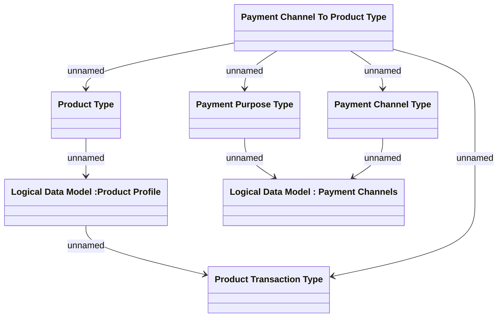

# Product Type - Payment Channel

```mermaid
classDiagram
    class Product_Transaction_Type["Product Transaction Type"]
    class Logical_Data_Model_Product_Profile["Logical Data Model :Product Profile"]
    class Logical_Data_Model_Payment_Channels["Logical Data Model : Payment Channels"]
    class Payment_Purpose_Type["Payment Purpose Type"]
    class Payment_Channel_Type["Payment Channel Type"]
    class Payment_Channel_To_Product_Type["Payment Channel To Product Type"]
    class Product_Type["Product Type"]
    Payment_Channel_To_Product_Type --> Product_Type : unnamed
    Payment_Channel_To_Product_Type --> Payment_Channel_Type : unnamed
    Payment_Channel_To_Product_Type --> Payment_Purpose_Type : unnamed
    Payment_Purpose_Type --> Logical_Data_Model_Payment_Channels : unnamed
    Payment_Channel_Type --> Logical_Data_Model_Payment_Channels : unnamed
    Logical_Data_Model_Product_Profile --> Product_Transaction_Type : unnamed
    Payment_Channel_To_Product_Type --> Product_Transaction_Type : unnamed
    Product_Type --> Logical_Data_Model_Product_Profile : unnamed
```
