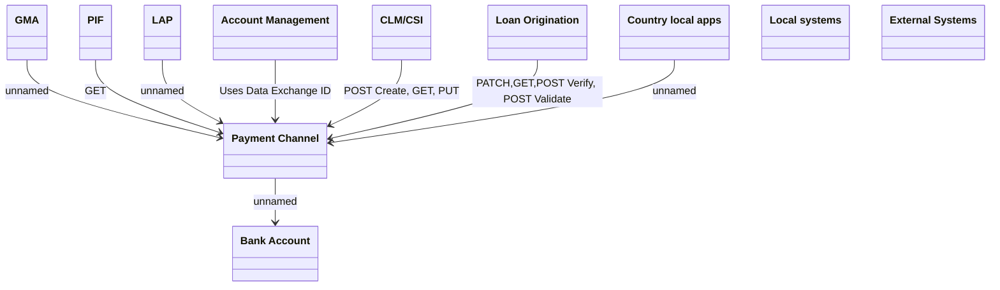

# Payment Channel Dependencies

```mermaid
classDiagram
    class LAP["LAP"]
    class Country_local_apps["Country local apps"]
    class GMA["GMA"]
    class PIF["PIF"]
    class CLM_CSI["CLM/CSI"]
    class Loan_Origination["Loan Origination"]
    class Account_Management["Account Management"]
    class Bank_Account["Bank Account"]
    class Payment_Channel["Payment Channel"]
    class Local_systems["Local systems"]
    class External_Systems["External Systems"]
    GMA --> Payment_Channel : unnamed
    PIF --> Payment_Channel : GET
    LAP --> Payment_Channel : unnamed
    Account_Management --> Payment_Channel : Uses Data Exchange ID
    CLM_CSI --> Payment_Channel : POST Create, GET, PUT
    Payment_Channel --> Bank_Account : unnamed
    Loan_Origination --> Payment_Channel : PATCH,GET,POST Verify, POST Validate
    Country_local_apps --> Payment_Channel : unnamed
```
