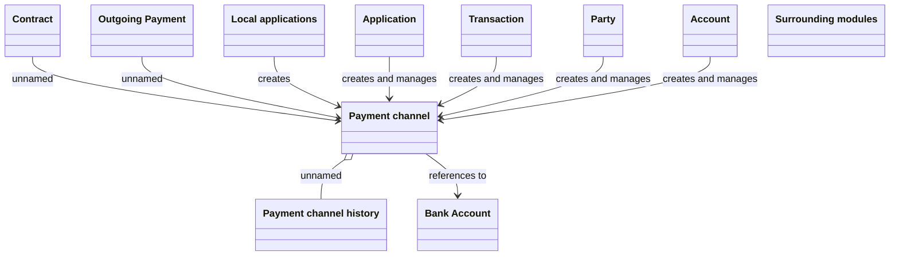

# Logical Data Model

- **Diagram Type**: Logical
- **Package**: HomerSelect/BSL/Analysis Model/Payments/Payment Channels Management/Payment Channels Model
- **Diagram ID**: 162023
- **Elements**: 12
- **Connectors**: 9

