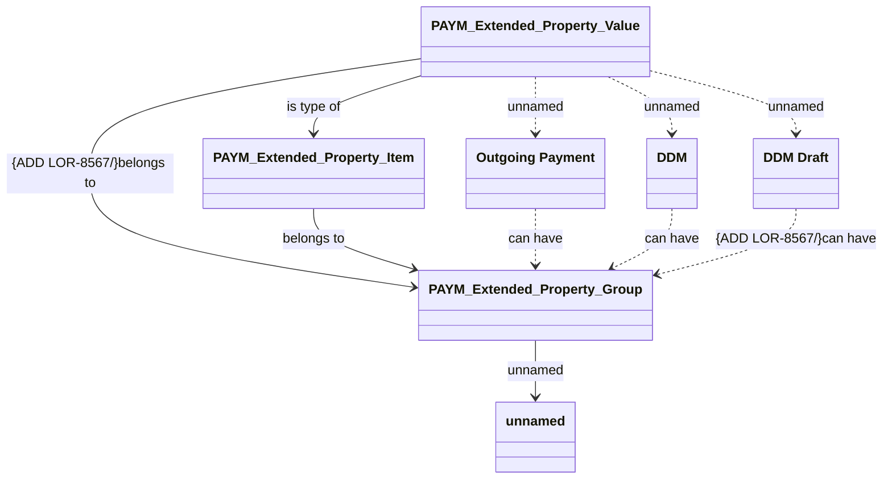

# PAYM Extended Properties

- **Diagram Type**: Logical
- **Package**: HomerSelect/BSL/Analysis Model/Payments/Payments Extended Property/Logical Data Model
- **Diagram ID**: 152267
- **Elements**: 7
- **Connectors**: 10

