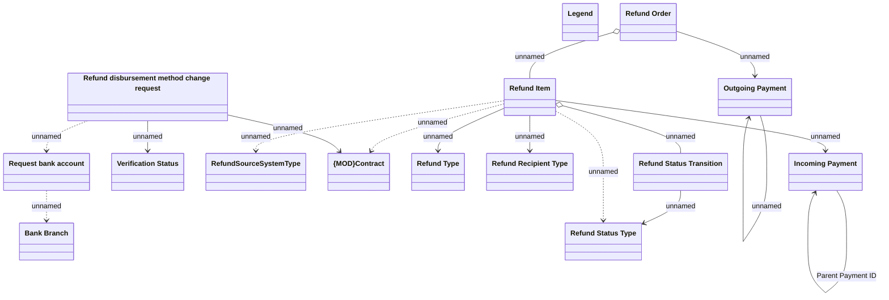

# Refunds domain model

- **Diagram Type**: Logical
- **Package**: HomerSelect/BSL/Analysis Model/Payments/Refunds/COMMON for Refunds/Logical Data Model
- **Diagram ID**: 162953
- **Elements**: 15
- **Connectors**: 17

