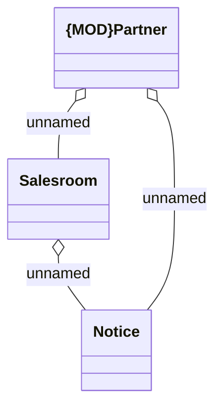

# SN Notice

- **Diagram Type**: Logical
- **Package**: HomerSelect/BSL/Analysis Model/Sales Network Management/COMMON for Sales Network Management/SN Notice/Logical Data Model
- **Diagram ID**: 39203
- **Elements**: 3
- **Connectors**: 3

