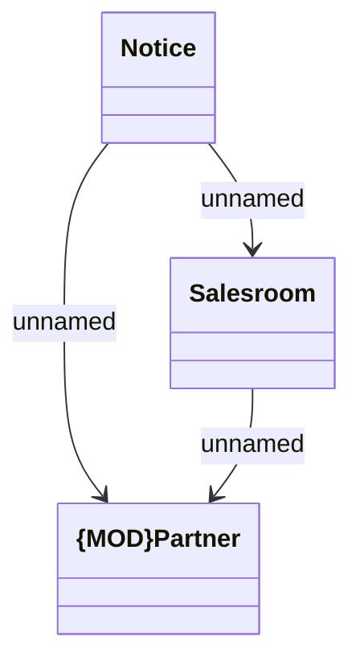

# SN Notice

```mermaid
classDiagram
    class Salesroom["Salesroom"]
    class MOD_Partner["{MOD}Partner"]
    class Notice["Notice"]
    Notice --> Salesroom : unnamed
    Notice --> MOD_Partner : unnamed
    Salesroom --> MOD_Partner : unnamed
```
