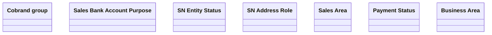

# SNM Common

- **Diagram Type**: Logical
- **Package**: HomerSelect/BSL/Analysis Model/Sales Network Management/COMMON for Sales Network Management/«functionality» COMMON for Common for Sales Network Management/Logical Data Model
- **Diagram ID**: 102211
- **Elements**: 7
- **Connectors**: 0

