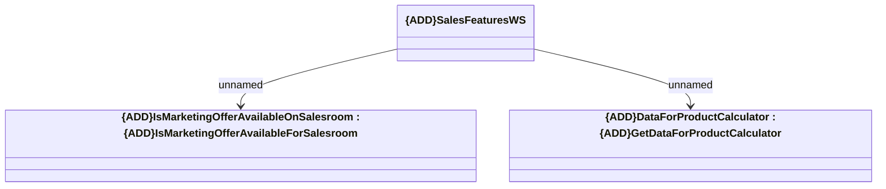

# SalesFeaturesWS

```mermaid
classDiagram
    class ADD_DataForProductCalculator_ADD_GetDataForProductCalculator["{ADD}DataForProductCalculator :{ADD}GetDataForProductCalculator"]
    class ADD_IsMarketingOfferAvailableOnSalesroom_ADD_IsMarketingOffe["{ADD}IsMarketingOfferAvailableOnSalesroom :{ADD}IsMarketingOfferAvailableForSalesroom"]
    class ADD_SalesFeaturesWS["{ADD}SalesFeaturesWS"]
    ADD_SalesFeaturesWS --> ADD_IsMarketingOfferAvailableOnSalesroom_ADD_IsMarketingOffe : unnamed
    ADD_SalesFeaturesWS --> ADD_DataForProductCalculator_ADD_GetDataForProductCalculator : unnamed
```
