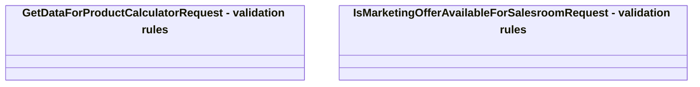

# Validation rules

- **Diagram Type**: Logical
- **Package**: HomerSelect/BSL/Analysis Model/Sales Network Management/COMMON for Sales Network Management/«functionality» COMMON for Common for Sales Network Management/{ADD}Sales Features/Validation rules
- **Diagram ID**: 116152
- **Elements**: 2
- **Connectors**: 0

