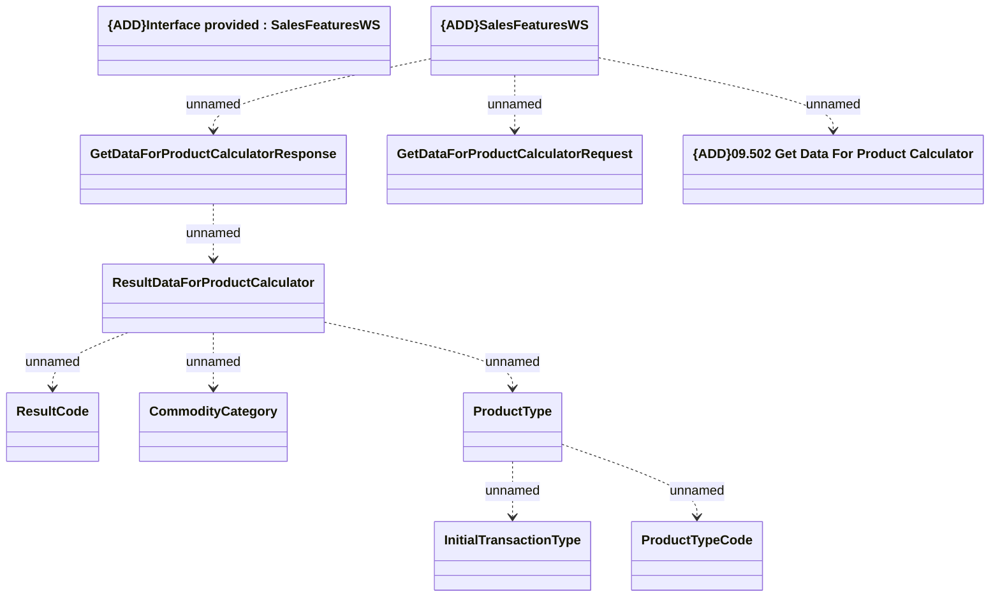

# {ADD}GetDataForProductCalculator

- **Diagram Type**: Logical
- **Package**: HomerSelect/BSL/Analysis Model/Sales Network Management/COMMON for Sales Network Management/«functionality» COMMON for Common for Sales Network Management/{ADD}Sales Features/{ADD}Interface provided/{ADD}GetDataForProductCalculator
- **Diagram ID**: 116148
- **Elements**: 11
- **Connectors**: 9

