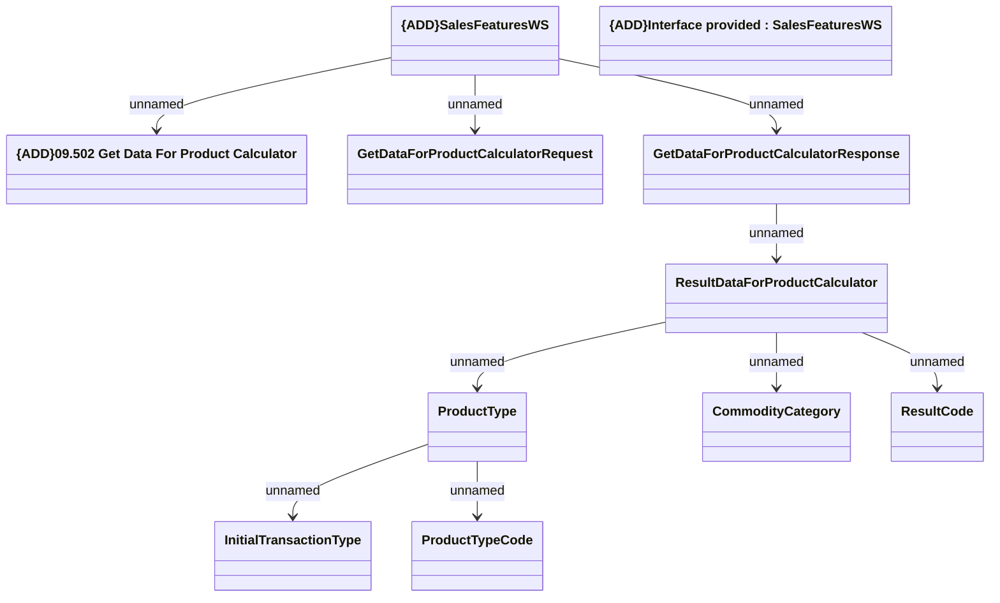

# {ADD}GetDataForProductCalculator

```mermaid
classDiagram
    class ADD_SalesFeaturesWS["{ADD}SalesFeaturesWS"]
    class ADD_Interface_provided_SalesFeaturesWS["{ADD}Interface provided : SalesFeaturesWS"]
    class ADD_09_502_Get_Data_For_Product_Calculator["{ADD}09.502 Get Data For Product Calculator"]
    class GetDataForProductCalculatorRequest["GetDataForProductCalculatorRequest"]
    class GetDataForProductCalculatorResponse["GetDataForProductCalculatorResponse"]
    class ResultDataForProductCalculator["ResultDataForProductCalculator"]
    class ProductType["ProductType"]
    class InitialTransactionType["InitialTransactionType"]
    class CommodityCategory["CommodityCategory"]
    class ResultCode["ResultCode"]
    class ProductTypeCode["ProductTypeCode"]
    ProductType --> InitialTransactionType : unnamed
    ResultDataForProductCalculator --> ProductType : unnamed
    ResultDataForProductCalculator --> CommodityCategory : unnamed
    GetDataForProductCalculatorResponse --> ResultDataForProductCalculator : unnamed
    ResultDataForProductCalculator --> ResultCode : unnamed
    ADD_SalesFeaturesWS --> ADD_09_502_Get_Data_For_Product_Calculator : unnamed
    ADD_SalesFeaturesWS --> GetDataForProductCalculatorRequest : unnamed
    ADD_SalesFeaturesWS --> GetDataForProductCalculatorResponse : unnamed
    ProductType --> ProductTypeCode : unnamed
```
