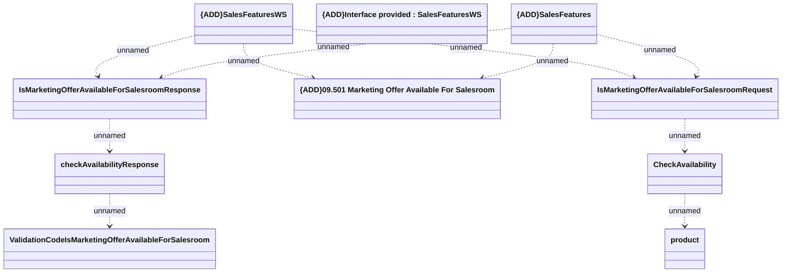

# {ADD}IsMarketingOfferAvailableForSalesroom

- **Diagram Type**: Logical
- **Package**: HomerSelect/BSL/Analysis Model/Sales Network Management/COMMON for Sales Network Management/«functionality» COMMON for Common for Sales Network Management/{ADD}Sales Features/{ADD}Interface provided/{ADD}IsMarketingOfferAvailableForSalesroom
- **Diagram ID**: 148769
- **Elements**: 10
- **Connectors**: 10

