# Partner

- **Diagram Type**: Logical
- **Package**: HomerSelect/BSL/Analysis Model/Sales Network Management/Partner/COMMON for Partner/Logical Data Model
- **Diagram ID**: 135067
- **Elements**: 33
- **Connectors**: 34

```mermaid
classDiagram
    class Partner_Disbursement_Channel_2_Payment_Provider["Partner Disbursement Channel 2 Payment Provider"]
    class Legal_Form["Legal Form"]
    class Partner_Cobrand_Group["Partner Cobrand Group"]
    class Cobrand_group["Cobrand group"]
    class Partner_Disbursement_Channel["Partner Disbursement Channel"]
    class Payment_Channel_Type["Payment Channel Type"]
    class Logical_Data_Model_Salesroom["Logical Data Model : Salesroom"]
    class Logical_Data_Model_Address_CORE["Logical Data Model : Address - CORE"]
    class Logical_Data_Model_Common_User["Logical Data Model : Common - User"]
    class Logical_Data_Model_Common_Person["Logical Data Model : Common - Person"]
    class Logical_Data_Model_Common_Contact["Logical Data Model : Common - Contact"]
    class Partner_Bank_Account["Partner Bank Account"]
    class Logical_Data_Model_Partner_Tax["Logical Data Model : Partner Tax"]
    class Logical_Data_Model_Commissions["Logical Data Model : Commissions"]
    class Partner_Type["Partner Type"]
    class Partner_Person_Type["Partner Person Type"]
    class Partner_Category_Type["Partner Category Type"]
    class Bank_Account["Bank Account"]
    class Address["Address"]
    class Partner_Person["Partner Person"]
    class PartnertContactPerson["PartnertContactPerson"]
    class Business_Area["Business Area"]
    class Person["Person"]
    class Partner_Contact["Partner Contact"]
    class Partner_Address["Partner Address"]
    class DEL_Commission["{DEL}Commission"]
    class User["User"]
    class Notice["Notice"]
    class Contact["Contact"]
    class MOD_Partner["{MOD}Partner"]
    class Salesroom["Salesroom"]
    class Partner_Status_Transitions["Partner Status Transitions"]
    class Product_Type["Product Type"]
    Partner_Bank_Account --> Bank_Account : unnamed
    MOD_Partner --> DEL_Commission : unnamed
    Logical_Data_Model_Common_Person --> Person : unnamed
    Partner_Person --> Person : unnamed
    Salesroom ..> Business_Area : unnamed
    MOD_Partner ..> Business_Area : unnamed
    Partner_Contact --> Partner_Person : unnamed
    MOD_Partner ..> Legal_Form : unnamed
    Logical_Data_Model_Address_CORE --> Address : unnamed
    MOD_Partner ..> Partner_Category_Type : unnamed
    Partner_Person ..> Partner_Person_Type : unnamed
    MOD_Partner ..> Partner_Type : unnamed
    Partner_Disbursement_Channel ..> Payment_Channel_Type : unnamed
    Partner_Disbursement_Channel o-- Partner_Disbursement_Channel_2_Payment_Provider : unnamed
    Partner_Cobrand_Group ..> Cobrand_group : unnamed
    Partner_Address --> Address : unnamed
    Partner_Disbursement_Channel --> MOD_Partner : unnamed
    MOD_Partner --> Partner_Status_Transitions : unnamed
    Partner_Status_Transitions --> Partner_Status_Transitions : unnamed
    Logical_Data_Model_Salesroom --> Salesroom : unnamed
    Salesroom o-- Notice : unnamed
    MOD_Partner o-- Partner_Address : unnamed
    MOD_Partner o-- Partner_Bank_Account : unnamed
    Logical_Data_Model_Common_User --> User : unnamed
    MOD_Partner o-- Partner_Contact : unnamed
    MOD_Partner --> User : unnamed
    MOD_Partner o-- Partner_Person : unnamed
    MOD_Partner o-- Partner_Cobrand_Group : unnamed
    MOD_Partner o-- Notice : unnamed
    Partner_Contact --> Contact : unnamed
    Logical_Data_Model_Common_Contact --> Contact : unnamed
    User --> User : unnamed
    Partner_Disbursement_Channel ..> Product_Type : unnamed
    MOD_Partner o-- Salesroom : unnamed
```

