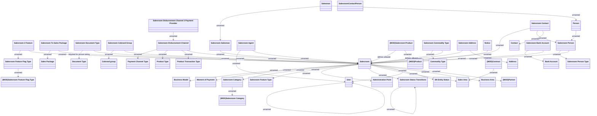

# Salesroom

```mermaid
classDiagram
    class MOD_Salesroom_Feature_Flag_Type["{MOD}Salesroom Feature Flag Type"]
    class MOD_Salesroom_Category["{MOD}Salesroom Category"]
    class Salesroom_Feature_Flag_Type["Salesroom Feature Flag Type"]
    class Salesroom_2_Feature["Salesroom 2 Feature"]
    class Product_Transaction_Type["Product Transaction Type"]
    class Sales_Package["Sales Package"]
    class Salesroom_To_Sales_Package["Salesroom To Sales Package"]
    class Salesroom_Disbursement_Channel_2_Payment_Provider["Salesroom Disbursement Channel 2 Payment Provider"]
    class Salesroom_Document_Type["Salesroom Document Type"]
    class Document_Type["Document Type"]
    class SN_Entity_Status["SN Entity Status"]
    class Sales_Area["Sales Area"]
    class Salesroom_Cobrand_Group["Salesroom Cobrand Group"]
    class Cobrand_group["Cobrand group"]
    class Product_Type["Product Type"]
    class Salesroom_Salesman["Salesroom Salesman"]
    class Administration_Point["Administration Point"]
    class Salesroom_Disbursement_Channel["Salesroom Disbursement Channel"]
    class Payment_Channel_Type["Payment Channel Type"]
    class Salesman["Salesman"]
    class MOD_Partner["{MOD}Partner"]
    class Salesroom_Agent["Salesroom Agent"]
    class MOD_Salesroom_Product["{MOD}Salesroom Product"]
    class Salesroom_Commodity_Type["Salesroom Commodity Type"]
    class Salesroom_Person_Type["Salesroom Person Type"]
    class Salesroom_Feature_Type["Salesroom Feature Type"]
    class Salesroom_Category["Salesroom Category"]
    class Moment_of_Payment["Moment of Payment"]
    class Business_Model["Business Model"]
    class Bank_Account["Bank Account"]
    class Address["Address"]
    class SalesroomContactPerson["SalesroomContactPerson"]
    class Salesroom_Status_Transitions["Salesroom Status Transitions"]
    class Business_Area["Business Area"]
    class Person["Person"]
    class Salesroom_Contact["Salesroom Contact"]
    class Salesroom_Address["Salesroom Address"]
    class MOD_Product["{MOD}Product"]
    class User["User"]
    class Notice["Notice"]
    class Contact["Contact"]
    class Salesroom_Person["Salesroom Person"]
    class MOD_Contract["{MOD}Contract"]
    class Commodity_Type["Commodity Type"]
    class Salesroom["Salesroom"]
    class Salesroom_Bank_Account["Salesroom Bank Account"]
    Salesroom_Cobrand_Group --> Cobrand_group : unnamed
    Salesroom_Bank_Account --> Bank_Account : unnamed
    Salesroom --> Business_Model : unnamed
    Salesroom --> Moment_of_Payment : unnamed
    Salesroom --> Salesroom_Category : unnamed
    Salesroom --> Salesroom_Feature_Type : unnamed
    Salesroom_Person --> Salesroom_Person_Type : unnamed
    Salesroom_Disbursement_Channel --> Payment_Channel_Type : unnamed
    Salesroom_Disbursement_Channel_2_Payment_Provider --> Salesroom_Disbursement_Channel : unnamed
    Salesroom --> Administration_Point : unnamed
    Salesroom_Disbursement_Channel --> Product_Type : unnamed
    Salesroom --> Salesroom_Status_Transitions : unnamed
    Salesroom --> Sales_Area : unnamed
    Salesroom --> SN_Entity_Status : unnamed
    Salesroom_Document_Type --> Document_Type : required for picture taking
    Salesroom_To_Sales_Package --> Sales_Package : unnamed
    Salesroom_Disbursement_Channel --> Product_Transaction_Type : unnamed
    Salesroom_2_Feature --> Salesroom_Feature_Flag_Type : unnamed
    Salesman --> Salesroom_Salesman : unnamed
    Salesroom_Commodity_Type --> Commodity_Type : unnamed
    Salesroom_Disbursement_Channel --> Salesroom : unnamed
    Salesroom_Contact --> Salesroom : unnamed
    Salesroom_Salesman --> Salesroom : unnamed
    Salesroom_Cobrand_Group --> Salesroom : unnamed
    Salesroom_Address --> Salesroom : unnamed
    Salesroom_Person --> Salesroom : unnamed
    MOD_Salesroom_Product --> Salesroom : defines allowed
    Salesroom_Document_Type --> Salesroom : unnamed
    Salesroom_Commodity_Type --> Salesroom : defines allowed
    Salesroom_Bank_Account --> Salesroom : unnamed
    Salesroom_To_Sales_Package --> Salesroom : unnamed
    Salesroom_Address --> Address : unnamed
    Notice --> Salesroom : unnamed
    Salesroom_Status_Transitions --> Salesroom_Status_Transitions : unnamed
    Person --> Salesroom_Person : unnamed
    Salesroom_Contact --> Salesroom_Person : unnamed
    Salesroom_Contact --> Contact : unnamed
    Salesroom --> User : unnamed
    Salesroom_Agent --> User : unnamed
    MOD_Salesroom_Product --> MOD_Product : unnamed
    Salesman --> Person : unnamed
    Salesroom --> Business_Area : unnamed
    Salesroom_Agent --> Salesroom : unnamed
    Salesroom_2_Feature --> Salesroom : unnamed
    MOD_Contract --> Sales_Area : unnamed
    User --> User : unnamed
    Salesroom_Feature_Flag_Type --> MOD_Salesroom_Feature_Flag_Type : unnamed
    Salesroom_Category --> MOD_Salesroom_Category : unnamed
    Salesroom --> MOD_Partner : unnamed
```
