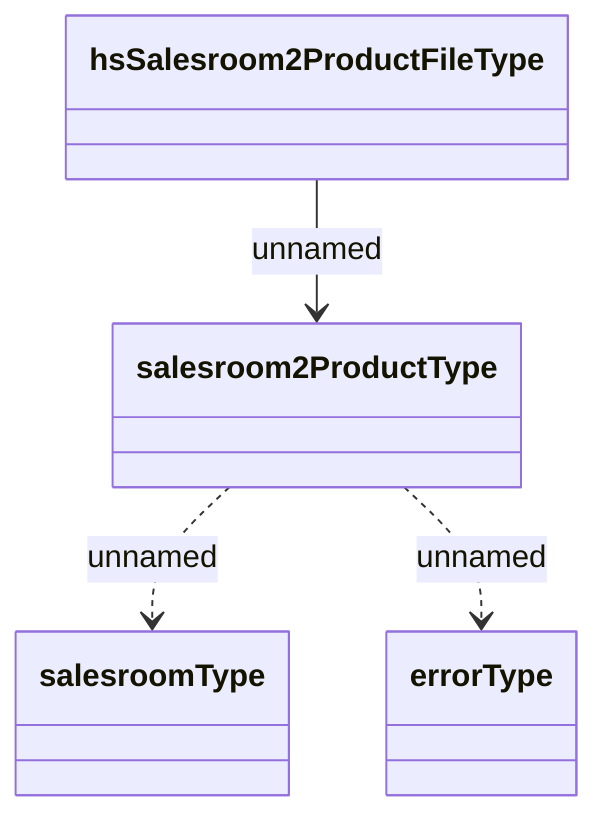

# Structure of files for import of assignment of Product to Salesroom

- **Diagram Type**: Logical
- **Package**: HomerSelect/BSL/Analysis Model/Sales Network Management/Salesroom/Products on Salesroom/Interface - import
- **Diagram ID**: 39240
- **Elements**: 4
- **Connectors**: 3

