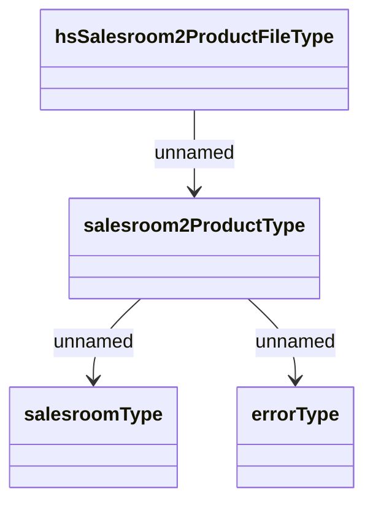

# Structure of files for import of assignment of Product to Salesroom

```mermaid
classDiagram
    class errorType["errorType"]
    class salesroomType["salesroomType"]
    class salesroom2ProductType["salesroom2ProductType"]
    class hsSalesroom2ProductFileType["hsSalesroom2ProductFileType"]
    hsSalesroom2ProductFileType --> salesroom2ProductType : unnamed
    salesroom2ProductType --> salesroomType : unnamed
    salesroom2ProductType --> errorType : unnamed
```
