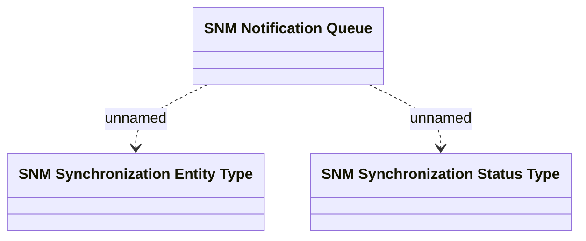

# SNM Notification Queue

- **Diagram Type**: Logical
- **Package**: HomerSelect/BSL/Analysis Model/Sales Network Management/Synchronization/Logical Domain Model
- **Diagram ID**: 71517
- **Elements**: 3
- **Connectors**: 2

