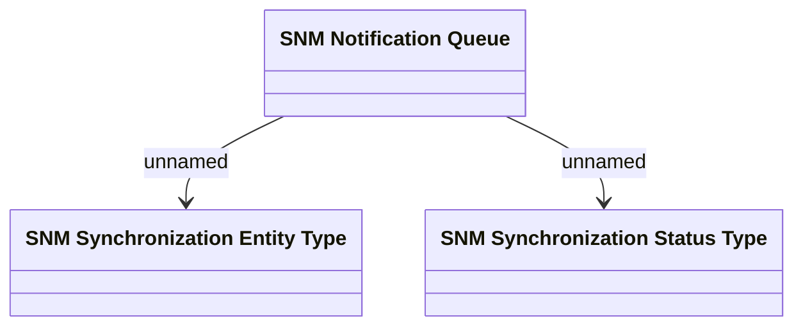

# SNM Notification Queue

```mermaid
classDiagram
    class SNM_Notification_Queue["SNM Notification Queue"]
    class SNM_Synchronization_Entity_Type["SNM Synchronization Entity Type"]
    class SNM_Synchronization_Status_Type["SNM Synchronization Status Type"]
    SNM_Notification_Queue --> SNM_Synchronization_Entity_Type : unnamed
    SNM_Notification_Queue --> SNM_Synchronization_Status_Type : unnamed
```
