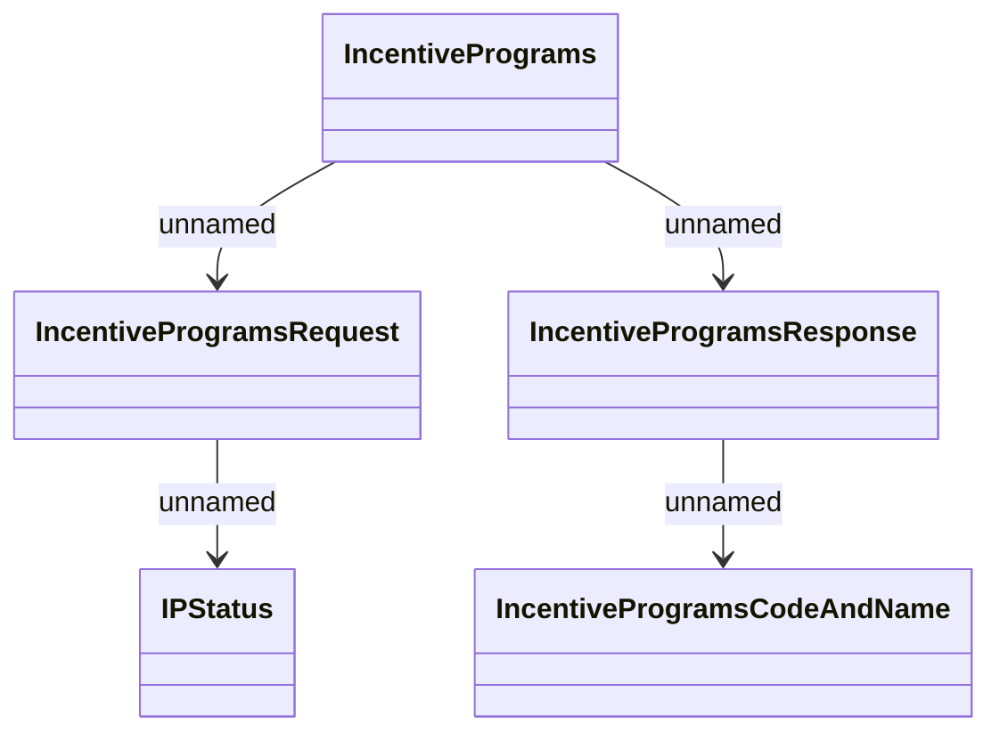

# IncentivePrograms

```mermaid
classDiagram
    class IncentiveProgramsCodeAndName["IncentiveProgramsCodeAndName"]
    class IncentiveProgramsResponse["IncentiveProgramsResponse"]
    class IPStatus["IPStatus"]
    class IncentiveProgramsRequest["IncentiveProgramsRequest"]
    class IncentivePrograms["IncentivePrograms"]
    IncentivePrograms --> IncentiveProgramsRequest : unnamed
    IncentiveProgramsRequest --> IPStatus : unnamed
    IncentivePrograms --> IncentiveProgramsResponse : unnamed
    IncentiveProgramsResponse --> IncentiveProgramsCodeAndName : unnamed
```
