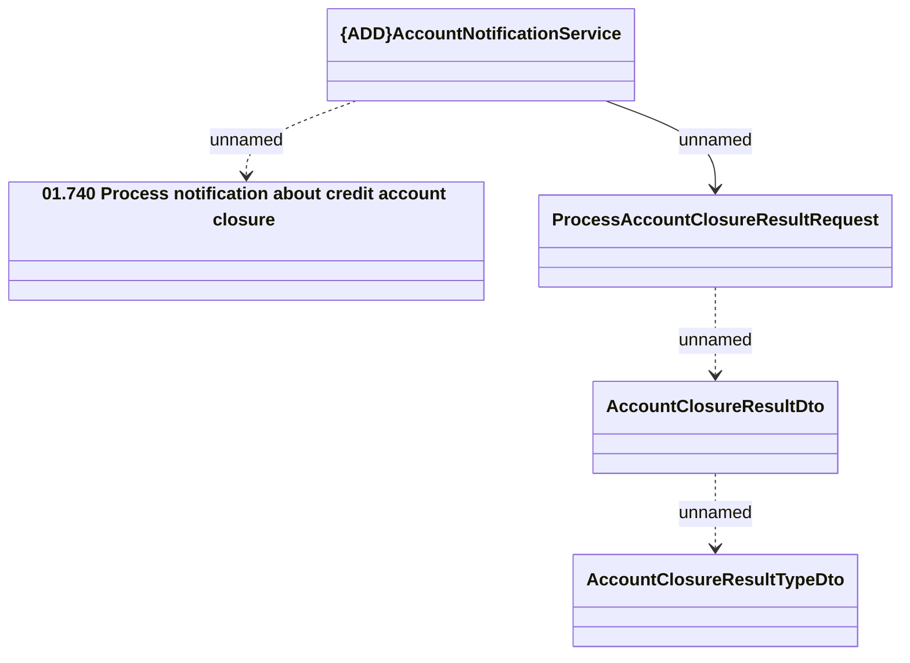

# ProcessAccountClosureResult

- **Diagram Type**: Logical
- **Package**: HomerSelect/BSL/Analysis Model/_Interface/Consumed services/Account management/ProcessAccountClosureResult
- **Diagram ID**: 139138
- **Elements**: 5
- **Connectors**: 4

