# Automatic Import response

- **Diagram Type**: Logical
- **Package**: HomerSelect/BSL/Analysis Model/_Interface/Consumed services/Automatic Import response
- **Diagram ID**: 93347
- **Elements**: 26
- **Connectors**: 16

```mermaid
classDiagram
    class n_04_123_Automatic_add_charging_requests["04.123 Automatic add charging requests"]
    class n_05_012_Automatic_import_incoming_payments["05.012 Automatic import incoming payments"]
    class ReceiveResultOfImportCommunicationResponse["ReceiveResultOfImportCommunicationResponse"]
    class ReceiveResultOfImportCommunicationRequest["ReceiveResultOfImportCommunicationRequest"]
    class MOD_07_060_Process_communication_list_file["{MOD}07.060 Process communication list file"]
    class DDstatementsResult["DDstatementsResult"]
    class DDstatementsConfirmationResult["DDstatementsConfirmationResult"]
    class IncomingPaymentsResult["IncomingPaymentsResult"]
    class ChargingRequestResult["ChargingRequestResult"]
    class ChargingRequestErrorImportResult["ChargingRequestErrorImportResult"]
    class n_05_261_Automatic_Import_DD_confirmations["05.261 Automatic Import DD confirmations"]
    class DDMconfirmationErrorImportResult["DDMconfirmationErrorImportResult"]
    class n_05_251_Automatic_Import_DD_statements["05.251 Automatic Import DD statements"]
    class DDMconfirmationResult["DDMconfirmationResult"]
    class n_01_585_Automatic_import_DDM_confirmation_result["01.585 Automatic import DDM confirmation result"]
    class diagram_F07CB0A2_92D4_40d8_895E_35E27DFCCED0["$diagram://{F07CB0A2-92D4-40d8-895E-35E27DFCCED0}"]
    class diagram_7A1D2F77_EE5A_41fd_9FE9_E93FDC407A63["$diagram://{7A1D2F77-EE5A-41fd-9FE9-E93FDC407A63}"]
    class diagram_AEEC0595_265E_4a87_BAFD_2AD20147B144["$diagram://{AEEC0595-265E-4a87-BAFD-2AD20147B144}"]
    class CommunicationListErrorImportResult["CommunicationListErrorImportResult"]
    class CommunicationListResult["CommunicationListResult"]
    class ResultAutomaticCommunicationListImportWS["ResultAutomaticCommunicationListImportWS"]
    class ResultAutomaticImportIncomingPaymentsWS["ResultAutomaticImportIncomingPaymentsWS"]
    class AutomaticChargingRequestsImportResultWS["AutomaticChargingRequestsImportResultWS"]
    class Add_charging_requests["Add charging requests"]
    class Communication_list["Communication list"]
    class Payments["Payments"]
    ResultAutomaticImportIncomingPaymentsWS ..> DDstatementsResult : unnamed
    ResultAutomaticImportIncomingPaymentsWS ..> DDstatementsConfirmationResult : unnamed
    ResultAutomaticImportIncomingPaymentsWS ..> IncomingPaymentsResult : unnamed
    AutomaticChargingRequestsImportResultWS ..> ChargingRequestResult : unnamed
    ChargingRequestResult o-- ChargingRequestErrorImportResult : unnamed
    ResultAutomaticImportIncomingPaymentsWS ..> DDMconfirmationResult : unnamed
    ResultAutomaticCommunicationListImportWS --> MOD_07_060_Process_communication_list_file : unnamed
    ReceiveResultOfImportCommunicationRequest ..> CommunicationListResult : unnamed
    ResultAutomaticCommunicationListImportWS ..> ReceiveResultOfImportCommunicationResponse : unnamed
    ResultAutomaticCommunicationListImportWS ..> ReceiveResultOfImportCommunicationRequest : unnamed
    DDMconfirmationResult o-- DDMconfirmationErrorImportResult : unnamed
    CommunicationListResult o-- CommunicationListErrorImportResult : unnamed
    n_01_585_Automatic_import_DDM_confirmation_result ..> ResultAutomaticImportIncomingPaymentsWS : unnamed
    n_05_261_Automatic_Import_DD_confirmations ..> ResultAutomaticImportIncomingPaymentsWS : unnamed
    n_05_251_Automatic_Import_DD_statements ..> ResultAutomaticImportIncomingPaymentsWS : unnamed
    n_04_123_Automatic_add_charging_requests ..> AutomaticChargingRequestsImportResultWS : unnamed
```

