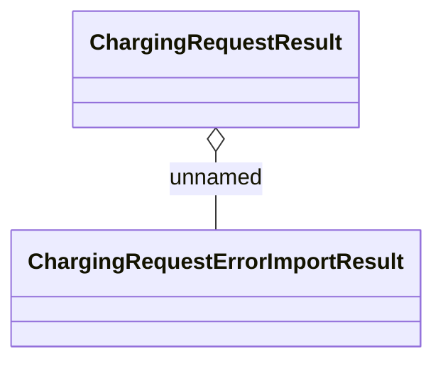

# ChargingRequestResult

- **Diagram Type**: Logical
- **Package**: HomerSelect/BSL/Analysis Model/_Interface/Consumed services/Automatic Import response/ChargingRequestResult
- **Diagram ID**: 40193
- **Elements**: 2
- **Connectors**: 1

